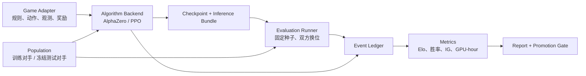

# AgentBenchRL 统一强化学习架构设计

## 1. 目标与边界

AgentBenchRL 为离散动作、多智能体游戏提供统一的训练、评测、晋级和资源核算框架。框架内置两条训练后端：

- AlphaZero：策略价值网络、MCTS、自博弈、专家轨迹预训练和 replay 优化；
- PPO：基于 Tianshou 2.0.1 的 masked actor-critic、向量环境和对手采样。

零和游戏的模型选择目标由 Elo 与胜率共同构成。训练损失用于优化网络参数，不代替最终的对局指标。候选模型必须在固定种子、双方换位和冻结测试人群上完成评测，才能形成可比较的 Elo、胜率和置信区间。

## 2. 系统分层

### 2.1 游戏适配层

每个游戏实现同一个 `DiscreteGame` 必需契约，并可提供算法扩展钩子：

| 接口 | 含义 |
|---|---|
| `spec` | 玩家数、零和属性、动作名、观测布局、最大步数 |
| `reset(seed)` | 使用显式种子创建确定性初始局面 |
| `current_player()` | 返回本步行动玩家 |
| `legal_action_mask()` | 返回与动作数组等长的合法动作布尔掩码 |
| `step(action)` | 执行规范化动作并返回转移记录 |
| `observe(player)` | 返回玩家相对的平面和标量观测 |
| `outcome(player)` | 终局返回 `-1/0/1`，非终局返回空值 |
| `clone()`（扩展） | 为 MCTS 提供无共享可变状态的高效复制；缺省使用深复制 |
| `score(player)`（扩展） | 返回规则原始分数，供协议审计和 PPO 势函数使用 |

新增游戏不实现神经网络、MCTS、PPO、Elo、日志或绘图代码。游戏作者只负责规则语义和编码语义。

### 2.2 算法层

AlphaZero 后端要求游戏可复制、完全可观测、动作离散且轮流行动。策略价值网络同时输出合法动作策略和当前玩家视角的局面价值。MCTS 使用网络先验扩展搜索树，自博弈结果写入 replay；完整专家轨迹可通过统一的 `ExpertTrajectory(seed, actions)` 接口重建观测、合法动作掩码和终局价值，用作训练冷启动。

PPO 后端把平面和标量编码为 masked observation，actor 输出合法动作分布，critic 估计状态价值。采样器在环境中与固定、随机或联赛对手交互，并使用 clipped policy objective、GAE 和熵正则更新策略。

PPO 对手边界支持无状态观测策略和官方有状态进程。进程对手按局接收初始化、双方动作与终局结果；单个进程绑定单个向量环境，避免并发对局交叉污染协议状态。训练池人类可作为课程对手，测试池人类只用于冻结候选后的评测。

两条后端共享游戏契约、配置系统、人口清单、checkpoint 元数据、评测执行器、事件账本和报告工具。

### 2.3 对手人口层

人口清单把对手分为两个集合：

- `train_human`：用于训练、调参、候选筛选；
- `heldout_human`：候选冻结后用于最终泛化评测。

每个条目记录 agent ID、内容哈希、协议、角色、执行命令、单步时限和来源信息。评测记录同时绑定候选哈希、对手哈希、配置哈希、种子和双方角色，保证结果可审计。

## 3. 游戏作者需要填写的信息

最小接入信息由四组声明组成：

1. 动作数组：每个整数动作代表的规则操作；
2. 观测数组：平面名称、棋盘形状、标量名称及其编码；
3. 终局收益：胜、和、负对应的零和数值；
4. 规则适配：重置、复制、合法动作、执行一步和终局判断。

PPO 可以额外提供原始分数；框架按配置的 `score_scale` 生成归一化零和势函数。奖励塑形保持双方反对称，并以终局胜负为主目标。AlphaZero 不需要人工编写中间奖励，使用终局结果训练 value head。

框架可统一所有算法和实验机制，但不能自动推断高质量 observation。若编码丢失影响规则结果或专家决策的信息，网络会面对不可消除的标签冲突。动作空间特别大、同时行动、部分可观测或不能高效复制的游戏也需要专门表示或算法扩展。

## 4. 统一实验与晋级协议

每次候选评测使用预生成 case：

- 每个种子生成双方换位的两局；
- 训练对手和冻结测试对手使用不同清单；
- 非法动作、超时、协议错误和缺失结果计入完整性指标；
- 原始动作序列写入 ledger，可由规则引擎重放；
- 候选选择只读取训练集合；最终结论只读取冻结测试集合。

晋级门由多指标联合控制：

- 对局完整率达到阈值；
- 训练人口 Elo 不低于基线；
- 胜率及 Wilson 置信区间达到阈值；
- 非法动作率和超时率不超过阈值；
- 资源预算不超过配置上限。

Elo 和胜率是最终优化目标的两个视角。Elo 汇总不同强度对手之间的相对表现，胜率保留可直接解释的对局比例；任何一个指标都不能由训练 loss 替代。

## 5. 指标与资源核算

事件账本是所有曲线的单一数据源。训练、评测和资源采样写入追加式 JSONL 事件，报告器按 iteration/checkpoint 聚合：

| 曲线或指标 | 定义 |
|---|---|
| Elo–iteration | 基于完整有效比赛拟合的锚定 Elo |
| 胜率–iteration | 候选得分率、胜率和 Wilson 置信区间 |
| IG–iteration | 新评测结果相对先验带来的信息增益 |
| GPU-hour | 分配 GPU 数量乘以阶段墙钟时间 |
| 资源峰值 | CPU、RSS、GPU 显存、GPU 利用率和功耗采样 |
| 完整性 | 计划 case 数、有效结果数、超时和非法动作数 |

训练与评测分别核算资源，报告同时给出阶段值和累计值。外部机器只作为运行环境，主机名和用户路径不进入仓库配置或提交产物。

## 6. SnakeGo 适配契约

SnakeGo 使用 6 个离散动作：右、上、左、下、开火、分裂。合法动作掩码处理反向移动限制、道具库存、长度和最多四蛇约束。

PPO 奖励适配保持为一个可选函数：游戏可实现
`training_potential(player)` 返回归一化的零和势函数；框架统一计算
`terminal_outcome + beta * (gamma * potential_next - potential_current)`。
未实现该函数时，框架使用双方分差和 `score_scale`。SnakeGo 的势函数由正式分数与尚未转化为身体长度的成长库存组成，因此拾取成长道具时即可获得与最终计分一致的稠密反馈。

观测由 85 个 `16×16` 平面和 154 个标量组成，采用行动玩家相对坐标：

- 活动蛇的头、身体、颈、尾和身体顺序；
- 双方聚合占用、墙、阻塞格和身体长度；
- 双方各四个官方顺序蛇槽位的完整身体顺序；
- 每个蛇槽位的存在、长度、增长库存、分裂道具和火炮道具；
- 当前和未来道具、出现时间、参数、数量及溢出摘要；每个棋盘格保留按出现时间排序的八个完整未来事件槽位；
- 回合、阶段索引、活动槽位、蛇数量、分差和首个道具归属。

蛇槽位遵循官方 `my_snakes` 列表顺序，使嵌套分裂后的身份和人类策略角色分配保持一致。玩家 1 的棋盘旋转 180 度，方向动作同步旋转，因此同一个网络可服务双方角色。

AlphaZero 的 value 目标为终局胜负。PPO 的势函数使用归一化分差，满足 `potential(player 0) = -potential(player 1)`。最大 episode 步数为 4096。

官方二进制协议由独立 wrapper 处理。推理包绑定动作名、平面名、标量名和网络配置；加载时必须精确匹配 schema，训练 replay、优化器和 RNG 状态不进入部署包。

## 7. 新游戏接入验收

一个新游戏进入统一训练前应满足：

1. 固定种子重置可复现；
2. clone 后状态独立；
3. 观测形状、数值范围和合法动作掩码稳定；
4. 玩家相对观测保持零和对称；
5. 终局 outcome 与原始分数一致；
6. 随机合法策略能完成整局；
7. AlphaZero 和 PPO smoke test 均可保存、恢复并继续训练；
8. 固定 checkpoint 的双方换位评测可重放；
9. Elo、胜率、IG 和资源报告可由 ledger 独立重建；
10. 推理产物通过 schema、协议和非法动作测试。

该验收把游戏特定工作限制在规则与表示层，使训练、评测和交付路径保持统一。
